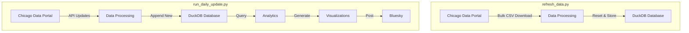

# Chicago Building Permits Bot 🏗️

A Python bot that tracks and analyzes Chicago building permits, providing daily insights about construction and renovation work happening across the city. The bot posts daily summaries to Bluesky, highlighting permit types, contractor activity, and geographic patterns.

## Overview

The bot tracks Chicago building permits through two main workflows:

### Full Data Refresh (`refresh_data.py`)
- Downloads complete permit dataset via CSV from Chicago Data Portal
- Cleans existing data files and state tracking
- Drops and recreates permits table in DuckDB
- Performs bulk insert of all permit data
- Includes validation checks and retry logic

### Daily Updates (`run_daily_update.py`)
- Fetches recent permits via Chicago Data Portal API
- Processes and stores new/updated permits in DuckDB
- Generates daily statistics including:
  - Total permits vs historical averages
  - Emergency vs regular permit counts
  - Contractor leaderboards
  - Day-of-week comparisons
- Creates visualizations:
  - Emergency permit heatmaps
  - Statistical charts
- Posts daily insights to Bluesky including:
  - Permit statistics and trends
  - Top contractor activity
  - Geographic visualizations

Both workflows include comprehensive error handling, data validation, and detailed logging.

## System Architecture

The bot operates through two main workflows:



The full refresh workflow (`refresh_data.py`) performs a complete data reset using bulk CSV download, while the daily update workflow (`run_daily_update.py`) fetches recent permits via API and generates insights.

## Components

### Data Pipeline (`src/data/`)
- `fetcher.py`: Handles data acquisition through:
  - Bulk CSV downloads for full refreshes
  - SODA API calls for daily updates
  - Data validation and normalization
- `storage.py`: Manages DuckDB operations:
  - Table creation and schema management
  - Bulk data insertions
  - Incremental updates
  - Data state tracking

### Analytics (`src/analytics/`)
- `stats.py`: Generates insights including:
  - Daily permit statistics and historical averages
  - Day-of-week comparisons with rolling averages
  - Contractor leaderboards with name normalization
  - Emergency vs regular permit analysis
  - Geographic distribution patterns
  - Comprehensive data validation and error handling

### Visualization (`src/visualization/`)
- `charts.py`: Creates data visualizations:
  - Interactive heatmaps showing permit density
  - Dual-layer heatmaps distinguishing emergency (red) vs regular (blue) permits
  - Chicago boundary overlay for context
  - Statistical trend charts with historical comparisons
  - Auto-compressed images for social media

- `property_image.py`: Location imagery:
  - Google Street View integration for permit locations
  - Geocoding with address normalization
  - Automatic image sizing and optimization
  - Retry logic for reliable fetching

### Data Analysis Features

The bot performs several types of analysis:

#### Statistical Analysis
- Calculates daily permit totals and emergency ratios
- Compares current numbers against historical averages
- Identifies trends in contractor activity
- Analyzes patterns by day of week
- Tracks geographic distribution of permits

#### Visualization Types
- **Heatmaps**: Shows permit density across Chicago
  - Separate layers for emergency and regular permits
  - Color-coded for easy distinction (red/blue)
  - Includes city boundary overlay
  
- **Location Images**: For random permit showcase
  - Fetches Google Street View images
  - Geocodes addresses for accurate positioning
  - Optimizes images for social media

- **Statistical Charts**: For trend analysis
  - Daily permit counts over time
  - Emergency vs regular permit ratios
  - Historical comparisons

### Social Media (`src/social/`)
- `bluesky.py`: Manages Bluesky integration:
  - Daily statistical summaries
  - Trend analysis posts
  - Geographic visualizations
  - Automated thread creation

## Scripts

- `refresh_data.py`: Performs complete data reset:
  - Cleans existing data files and state tracking
  - Downloads full dataset via CSV
  - Rebuilds database from scratch
  - Includes validation and retry logic

- `run_daily_update.py`: Executes daily pipeline:
  - Fetches recent permits via API
  - Updates database incrementally
  - Generates statistics and comparisons
  - Creates visualizations (heatmaps, charts)
  - Posts daily insights to Bluesky
  - Includes comprehensive error handling

- `post_random_permit.py`: Random permit showcase:
  - Selects random permit from yesterday
  - Fetches location image via Google Street View
  - Creates informative social post
  - Runs every 3 hours via PM2 cron

- `run_production.py`: Production orchestration:
  - Manages overall bot operation
  - Coordinates between scripts
  - Handles environment setup
  - Ensures proper execution order

## Setup

1. Install dependencies:
```bash
pip install -r requirements.txt
```

2. Configure environment variables in `.env`:
```bash
# Bluesky credentials
BLUESKY_HANDLE=your.handle.bsky.social
BLUESKY_PASSWORD=your-password

# Data Portal token
CHICAGO_DATA_PORTAL_TOKEN=your-token

# Google Maps (for property images)
GOOGLE_MAPS_API_KEY=your-api-key
```

3. Initialize the database:
```bash
PYTHONPATH=$PYTHONPATH:src python src/scripts/init_duckdb.py
```

4. Run initial data fetch:
```bash
PYTHONPATH=$PYTHONPATH:src python src/scripts/refresh_data.py
```

## Production Deployment

The bot uses PM2 for process management:

1. Create ecosystem.config.js:
```javascript
module.exports = {
  apps: [{
    name: "chicago-permits-daily",
    script: "src/scripts/run_daily_update.py",
    interpreter: "./venv/bin/python",
    env: {
      PYTHONPATH: "src"
    },
    cron_restart: "0 10 * * *",  // 10am daily
    autorestart: false
  },
  {
    name: "chicago-permits-random",
    script: "src/scripts/post_random_permit.py",
    interpreter: "./venv/bin/python",
    env: {
      PYTHONPATH: "src"
    },
    cron_restart: "0 */3 * * *",  // Every 3 hours
    autorestart: false
  }]
}
```

2. Start with PM2:
```bash
pm2 start ecosystem.config.js
pm2 save
pm2 startup
```

## Contributing

Contributions are welcome! Please feel free to submit a Pull Request.

## License

This project is licensed under the MIT License - see the LICENSE file for details.
