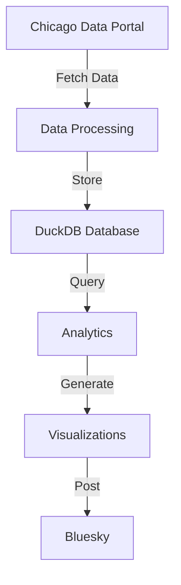

# Chicago Building Permits Bot 🏗️

A Python bot that tracks and analyzes Chicago building permits, providing daily insights about construction and renovation work happening across the city. The bot posts daily summaries to Bluesky, highlighting permit types, contractor activity, and geographic patterns.

## Overview

The bot automatically:
1. Fetches building permit data from Chicago's Data Portal
2. Processes and stores data in DuckDB
3. Analyzes permits for interesting patterns
4. Generates visualizations and statistics
5. Posts insights to Bluesky

## System Architecture



## Components

### Data Pipeline (`src/data/`)
- `fetcher.py`: Connects to Chicago's Data Portal API
- `storage.py`: Manages DuckDB operations and data schema

### Analytics (`src/analytics/`)
- `stats.py`: Calculates permit statistics and identifies trends

### Visualization (`src/visualization/`)
- `charts.py`: Generates statistical visualizations
- `property_image.py`: Creates property location images

### Social Media (`src/social/`)
- `bluesky.py`: Handles social media posting

## Scripts

- `refresh_data.py`: Updates permit data from the API
- `run_daily_update.py`: Executes daily analysis and posting
- `run_production.py`: Runs the full production pipeline
- `post_random_permit.py`: Posts a random permit with location image

## Setup

1. Install dependencies:
```bash
pip install -r requirements.txt
```

2. Configure environment variables in `.env`:
```bash
# Bluesky credentials
BLUESKY_HANDLE=your.handle.bsky.social
BLUESKY_PASSWORD=your-password

# Data Portal token
CHICAGO_DATA_PORTAL_TOKEN=your-token

# Google Maps (for property images)
GOOGLE_MAPS_API_KEY=your-api-key
```

3. Initialize the database:
```bash
PYTHONPATH=$PYTHONPATH:src python src/scripts/init_duckdb.py
```

4. Run initial data fetch:
```bash
PYTHONPATH=$PYTHONPATH:src python src/scripts/refresh_data.py
```

## Production Deployment

The bot uses PM2 for process management:

1. Create ecosystem.config.js:
```javascript
module.exports = {
  apps: [{
    name: "chicago-permits-daily",
    script: "src/scripts/run_daily_update.py",
    interpreter: "./venv/bin/python",
    env: {
      PYTHONPATH: "src"
    },
    cron_restart: "0 10 * * *"  // 10am daily
  }]
}
```

2. Start with PM2:
```bash
pm2 start ecosystem.config.js
pm2 save
pm2 startup
```

## Contributing

Contributions are welcome! Please feel free to submit a Pull Request.

## License

This project is licensed under the MIT License - see the LICENSE file for details.
