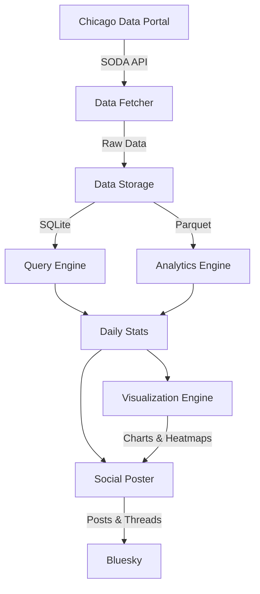

# Chicago Dig Bot 🚧

A Python bot that tracks and analyzes Chicago 811 dig tickets, providing daily insights about infrastructure work happening across the city. The bot posts daily summaries to Bluesky, highlighting emergency vs regular dig permits, contractor activity, and geographic patterns.

## System Architecture

The bot operates through three main workflows: data refresh, daily updates, and random permit posts. Each workflow is built on a modular architecture that separates data collection, analysis, visualization, and social media integration:
### Core Workflows

1. **Data Refresh** (src/scripts/refresh_data.py)
   - Performs complete data refresh from Chicago 811 API
   - Cleans existing data files
   - Validates and stores complete dataset
   - Used for initial setup and data resets

2. **Daily Update** (src/scripts/run_daily_update.py)
   - Fetches recent permit data
   - Updates storage with new records
   - Generates statistics and visualizations
   - Posts daily summary thread to Bluesky

3. **Random Permit** (src/scripts/post_random_permit.py)
   - Selects random permit from yesterday
   - Fetches Google Street View image of location
   - Posts permit details with image to Bluesky
   - Runs every 3 hours via cron

### Component Architecture



### Data Pipeline Architecture

```mermaid
graph TD
    subgraph Refresh
        R1[Chicago Data Portal] -->|Full Dataset| R2[Data Cleaning]
        R2 -->|Validated Data| R3[Storage Reset]
    end
    
    subgraph Daily Update
        D1[Chicago Data Portal] -->|Recent Data| D2[Data Validation]
        D2 -->|New Records| D3[Storage Update]
        D3 -->|Current Data| D4[Analytics]
        D4 -->|Stats & Trends| D5[Visualization]
        D5 -->|Charts & Maps| D6[Social Posts]
    end
    
    subgraph Random Permit
        P1[Parquet Storage] -->|Query Yesterday| P2[Random Selection]
        P2 -->|Address| P3[Street View API]
        P3 -->|Location Image| P4[Format Post]
        P4 -->|Post Content| P5[Social Update]
    end
```



The data pipeline ensures data quality and efficient storage:
- **Data Fetcher**: Connects to Chicago's SODA API to fetch new dig tickets
- **Validation Layer**: Ensures data integrity and proper formatting
- **Dual Storage**:
  - SQLite for operational queries and daily updates
  - Parquet for efficient analytics and historical analysis
- **Data Schema**: Normalized structure for consistent analysis

## Features

### 🔍 Data Collection & Analysis
- Fetches dig ticket data from Chicago's data portal
- Tracks both emergency and regular dig permits
- Maintains historical data for trend analysis
- Generates daily statistics and comparisons
- Identifies patterns in contractor activity

### 📊 Visualizations
- Creates heatmaps showing dig activity across Chicago
- Differentiates between emergency and regular permits
- Generates daily statistical charts and comparisons

### 📱 Social Media Integration
- Posts daily summaries to Bluesky
- Includes permit statistics and comparisons
- Features top contractor leaderboards
- Highlights newcomer contractors
- Shares geographic visualizations

### 🎲 Hole Roulette
- Posts a random dig permit from yesterday every 3 hours
- Includes Google Street View image of the dig location
- Shows permit details like work type and emergency status
- Provides an engaging way to explore dig activity across Chicago

### 📈 Analytics Features
- Day-of-week comparisons
- Rolling averages
- Contractor leaderboards
- Geographic clustering analysis
- Emergency vs regular permit tracking

## Technical Components

### Data Storage (src/data/storage.py)
- **DataStorage Class**: Manages both SQLite and Parquet storage
- Efficient batch processing with WAL mode
- Handles data type conversion and normalization
- Maintains data integrity with UPSERT operations

### Analytics Engine (src/analytics/stats.py)
- **StatsGenerator Class**: Produces daily statistics and trends
- Contractor name normalization with extensive rule sets
- Historical comparisons and rolling averages
- Geographic pattern analysis

### Social Integration (src/social/bluesky.py)
- **BlueskyPoster Class**: Manages social media updates
- Thread creation with rich media support
- Rate limiting and error handling
- Test mode for development

## Data Schema

The bot uses a normalized schema for storing dig ticket data:

| Field Name | Type | Description |
|------------|------|-------------|
| ticket_number | string | Unique identifier for the dig ticket |
| dig_date | datetime | Date when digging is scheduled to begin |
| street_number_from | int | Starting street number of dig location |
| street_direction | string | Street direction (N, S, E, W) |
| street_name | string | Name of the street |
| street_suffix | string | Street suffix (ST, AVE, BLVD, etc.) |
| dig_location | string | Type of work being performed |
| is_emergency | boolean | Whether this is an emergency dig |
| contractor_name | string | Name of the contractor |
| request_date | datetime | When the permit was requested |
| expiration_date | datetime | When the permit expires |
| latitude | float | Location latitude |
| longitude | float | Location longitude |

## Configuration

The bot is configured via `config.yaml` with the following main sections:

```yaml
# Data Collection Settings
data:
  data_dir: "data"
  initial_csv_path: "https://data.cityofchicago.org/api/views/gptz-y9ub/rows.csv"
  soda_api:
    url: "https://data.cityofchicago.org/resource/gptz-y9ub.json"
    days_to_fetch: 30

# Analytics Settings
analytics:
  stats:
    emergency_threshold_hours: 2
    aggregation_period: "day"
    rolling_window_days: 7

# Visualization Settings
visualization:
  chart:
    filename: "daily_chart.png"
  heatmap:
    emergency_filename: "emergency_heatmap.html"

# Social Media Settings
social:
  bluesky:
    username: "${BLUESKY_HANDLE}"
    password: "${BLUESKY_PASSWORD}"
```

## Setup

### System Requirements

The bot requires Ubuntu/Debian-based Linux with the following system dependencies:

```bash
# Update package list
sudo apt update

# Install Python and development tools
sudo apt install -y python3 python3-venv python3-pip git

# Install Chrome and dependencies for headless operation (required for visualizations)
wget https://dl.google.com/linux/direct/google-chrome-stable_current_amd64.deb
sudo apt install -y ./google-chrome-stable_current_amd64.deb
sudo apt install -y xvfb libgbm1
rm google-chrome-stable_current_amd64.deb
```

### Project Setup

1. Clone the repository:
```bash
git clone https://github.com/MisterClean/chicago-dig-bot.git
cd chicago-dig-bot
```

2. Create and activate a Python virtual environment:
```bash
python3 -m venv venv
source venv/bin/activate
```

3. Install Python dependencies:
```bash
pip install -r requirements.txt
```

4. Create `.env` file with your credentials:
```bash
cat > .env << EOL
# Bluesky credentials
BLUESKY_HANDLE=your.handle.bsky.social
BLUESKY_PASSWORD=your-password

# Data Portal token
CHICAGO_DATA_PORTAL_TOKEN=your-token

# Google Maps
GOOGLE_MAPS_API_KEY=your-api-key
EOL
```

5. Initialize the database:
```bash
PYTHONPATH=$PYTHONPATH:src python src/scripts/init_duckdb.py
```

6. Run initial data collection:
```bash
PYTHONPATH=$PYTHONPATH:src python src/scripts/refresh_data.py
```

### Verify Installation

Test each component to ensure everything is working:

1. Test random permit posting:
```bash
PYTHONPATH=$PYTHONPATH:src python src/scripts/post_random_permit.py
```

2. Test daily update:
```bash
PYTHONPATH=$PYTHONPATH:src python src/scripts/run_daily_update.py
```

### Troubleshooting

1. **ModuleNotFoundError**: Make sure PYTHONPATH includes the src directory:
```bash
PYTHONPATH=$PYTHONPATH:src python your_script.py
```

2. **Chrome/Selenium Issues**: If you encounter Chrome-related errors:
```bash
# Verify Chrome is installed
google-chrome --version

# Check/install additional dependencies
sudo apt install -y xvfb libgbm1
```

3. **Database Issues**: If DuckDB errors occur:
```bash
# Reinitialize the database
PYTHONPATH=$PYTHONPATH:src python src/scripts/init_duckdb.py
```

## Production Deployment

The bot uses PM2 for process management in production. Here's how to set it up on a Lightsail instance:

1. Install PM2 globally:
```bash
npm install pm2 -g
```

2. Create PM2 ecosystem file (ecosystem.config.js):
```javascript
module.exports = {
  apps: [{
    name: "chicago-dig-daily",
    script: "src/scripts/run_daily_update.py",
    interpreter: "./venv/bin/python",
    cwd: "/path/to/chicago-dig-bot",
    env: {
      PYTHONPATH: "src"
    },
    cron_restart: "0 10 * * *",  // 10am daily
    autorestart: false
  },
  {
    name: "chicago-dig-roulette",
    script: "src/scripts/post_random_permit.py",
    interpreter: "./venv/bin/python",
    cwd: "/path/to/chicago-dig-bot",
    env: {
      PYTHONPATH: "src"
    },
    cron_restart: "0 */3 * * *",  // Every 3 hours
    autorestart: false
  }]
}
```

3. Start the processes:
```bash
pm2 start ecosystem.config.js
```

4. Save the PM2 process list:
```bash
pm2 save
```

5. Setup PM2 to start on system boot:
```bash
pm2 startup
```

6. Monitor the processes:
```bash
pm2 list  # View all processes
pm2 logs  # View logs
pm2 monit # Monitor CPU/Memory usage
```

## Contributing

Contributions are welcome! Please feel free to submit a Pull Request.

## License

This project is licensed under the MIT License - see the LICENSE file for details.
