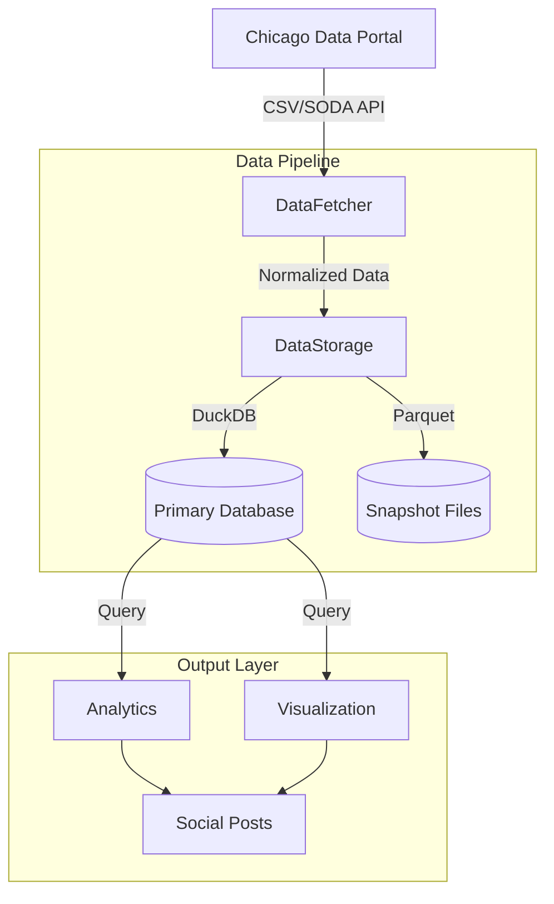

# Chicago Dig Bot 🚧

A Python bot that tracks and analyzes Chicago 811 dig tickets, providing daily insights about infrastructure work happening across the city. The bot posts daily summaries to Bluesky, highlighting emergency vs regular dig permits, contractor activity, and geographic patterns.

## Overview

The Chicago Dig Bot monitors the City of Chicago's 811 dig ticket data to:
- Track new dig permits issued across the city
- Analyze patterns in emergency vs regular dig work
- Identify active contractors and their work patterns
- Generate visualizations of dig activity across Chicago
- Share daily insights via Bluesky social network

## Features

### 🔍 Data Collection & Analysis
- Fetches dig ticket data from Chicago's data portal
- Tracks both emergency and regular dig permits
- Maintains historical data for trend analysis
- Generates daily statistics and comparisons
- Identifies patterns in contractor activity

### 📊 Visualizations
- Creates heatmaps showing dig activity across Chicago
- Differentiates between emergency and regular permits
- Generates daily statistical charts and comparisons

### 📱 Social Media Integration
- Posts daily summaries to Bluesky
- Includes permit statistics and comparisons
- Features top contractor leaderboards
- Highlights newcomer contractors
- Shares geographic visualizations

### 🎲 Hole Roulette
- Posts a random dig permit from yesterday every 3 hours
- Includes Google Street View image of the dig location
- Shows permit details like work type and emergency status
- Provides an engaging way to explore dig activity across Chicago

### 📈 Analytics Features
- Day-of-week comparisons
- Rolling averages
- Contractor leaderboards
- Geographic clustering analysis
- Emergency vs regular permit tracking

## Data Source

The data comes from the [Chicago Data Portal 811 Dig Tickets dataset](https://data.cityofchicago.org/Transportation/Chicago-811-Dig-Tickets/gptz-y9ub). To access the data programmatically, you'll need an API key from the Chicago Data Portal:

1. Create an account at [Chicago Data Portal](https://data.cityofchicago.org)
2. Go to your profile and click on "Developer Settings"
3. Create a new API key
4. Add the API key to your `.env` file as `CHICAGO_DATA_PORTAL_TOKEN`

## Data Schema

The bot uses parquet files to store dig ticket data with the following schema:

| Field Name | Type | Description |
|------------|------|-------------|
| ticket_number | string | Unique identifier for the dig ticket |
| dig_date | datetime | Date when digging is scheduled to begin |
| street_number_from | int | Starting street number of dig location |
| street_direction | string | Street direction (N, S, E, W) |
| street_name | string | Name of the street |
| street_suffix | string | Street suffix (ST, AVE, BLVD, etc.) |
| dig_location | string | Type of work being performed |
| is_emergency | boolean | Whether this is an emergency dig |
| contractor_name | string | Name of the contractor |
| request_date | datetime | When the permit was requested |
| expiration_date | datetime | When the permit expires |
| latitude | float | Location latitude |
| longitude | float | Location longitude |

## Configuration

The bot is configured via `config.yaml` with the following main sections:

```yaml
# Data Collection Settings
data:
  data_dir: "data"
  initial_csv_path: "https://data.cityofchicago.org/api/views/gptz-y9ub/rows.csv"
  soda_api:
    url: "https://data.cityofchicago.org/resource/gptz-y9ub.json"
    days_to_fetch: 30

# Analytics Settings
analytics:
  stats:
    emergency_threshold_hours: 2
    aggregation_period: "day"
    rolling_window_days: 7

# Visualization Settings
visualization:
  chart:
    filename: "daily_chart.png"
  heatmap:
    emergency_filename: "emergency_heatmap.html"

# Social Media Settings
social:
  bluesky:
    username: "${BLUESKY_HANDLE}"
    password: "${BLUESKY_PASSWORD}"
```

## Setup

### System Requirements

The bot requires Ubuntu/Debian-based Linux with the following system dependencies:

```bash
# Update package list
sudo apt update

# Install Python and development tools
sudo apt install -y python3 python3-venv python3-pip git

# Install Chrome and dependencies for headless operation (required for visualizations)
wget https://dl.google.com/linux/direct/google-chrome-stable_current_amd64.deb
sudo apt install -y ./google-chrome-stable_current_amd64.deb
sudo apt install -y xvfb libgbm1
rm google-chrome-stable_current_amd64.deb
```

### Project Setup

1. Clone the repository:
```bash
git clone https://github.com/MisterClean/chicago-dig-bot.git
cd chicago-dig-bot
```

2. Create and activate a Python virtual environment:
```bash
python3 -m venv venv
source venv/bin/activate
```

3. Install Python dependencies:
```bash
pip install -r requirements.txt
```

4. Create `.env` file with your credentials:
```bash
cat > .env << EOL
# Bluesky credentials
BLUESKY_HANDLE=your.handle.bsky.social
BLUESKY_PASSWORD=your-password

# Data Portal token
CHICAGO_DATA_PORTAL_TOKEN=your-token

# Google Maps
GOOGLE_MAPS_API_KEY=your-api-key
EOL
```

5. Initialize the database:
```bash
PYTHONPATH=$PYTHONPATH:src python src/scripts/init_duckdb.py
```

6. Run initial data collection:
```bash
PYTHONPATH=$PYTHONPATH:src python src/scripts/refresh_data.py
```

### Verify Installation

Test each component to ensure everything is working:

1. Test random permit posting:
```bash
PYTHONPATH=$PYTHONPATH:src python src/scripts/post_random_permit.py
```

2. Test daily update:
```bash
PYTHONPATH=$PYTHONPATH:src python src/scripts/run_daily_update.py
```

### Troubleshooting

1. **ModuleNotFoundError**: Make sure PYTHONPATH includes the src directory:
```bash
PYTHONPATH=$PYTHONPATH:src python your_script.py
```

2. **Chrome/Selenium Issues**: If you encounter Chrome-related errors:
```bash
# Verify Chrome is installed
google-chrome --version

# Check/install additional dependencies
sudo apt install -y xvfb libgbm1
```

3. **Database Issues**: If DuckDB errors occur:
```bash
# Reinitialize the database
PYTHONPATH=$PYTHONPATH:src python src/scripts/init_duckdb.py
```

## Usage

### Daily Updates
Run the daily update script to fetch new data and post updates:
```bash
PYTHONPATH=$PYTHONPATH:src python src/scripts/run_daily_update.py
```

This will:
1. Fetch the latest dig ticket data
2. Update statistics and analytics
3. Generate new visualizations
4. Post updates to Bluesky

### Test Mode
Enable test mode in `config.yaml` to run without posting to Bluesky:
```yaml
test_mode: true
```

## Production Deployment

The bot uses PM2 for process management in production. Here's how to set it up on a Lightsail instance:

1. Install PM2 globally:
```bash
npm install pm2 -g
```

2. Create PM2 ecosystem file (ecosystem.config.js):
```javascript
module.exports = {
  apps: [{
    name: "chicago-dig-daily",
    script: "src/scripts/run_daily_update.py",
    interpreter: "./venv/bin/python",
    cwd: "/path/to/chicago-dig-bot",
    env: {
      PYTHONPATH: "src"
    },
    cron_restart: "0 10 * * *",  // 10am daily
    autorestart: false
  },
  {
    name: "chicago-dig-roulette",
    script: "src/scripts/post_random_permit.py",
    interpreter: "./venv/bin/python",
    cwd: "/path/to/chicago-dig-bot",
    env: {
      PYTHONPATH: "src"
    },
    cron_restart: "0 */3 * * *",  // Every 3 hours
    autorestart: false
  }]
}
```

Note: Replace `/path/to/chicago-dig-bot` with your actual project path.

3. Start the processes:
```bash
pm2 start ecosystem.config.js
```

4. Save the PM2 process list:
```bash
pm2 save
```

5. Setup PM2 to start on system boot:
```bash
pm2 startup
```

6. Monitor the processes:
```bash
pm2 list  # View all processes
pm2 logs  # View logs
pm2 monit # Monitor CPU/Memory usage
```

## Data Architecture

The bot uses a robust data pipeline architecture to collect, store, and analyze Chicago 811 dig ticket data:

### Data Sources
- **Chicago Data Portal**
  - Full dataset via CSV endpoint (initial load)
  - Recent updates via SODA API (daily updates)
  - Configurable fetch window with overlap for late-arriving tickets

### Data Pipeline Components

1. **Data Acquisition (DataFetcher)**
   - Fetches data from Chicago Data Portal
   - Handles both CSV and SODA API endpoints
   - Normalizes column names and data types
   - Validates data completeness
   - Tracks fetch history and handles no-data scenarios

2. **Data Storage (DataStorage)**
   - Dual storage strategy:
     - DuckDB for fast querying and analysis
     - Parquet files for data snapshots
   - Schema validation and enforcement
   - Efficient bulk operations
   - Handles both new records and updates

3. **Pipeline Orchestration (refresh_data)**
   - Manages full data refresh workflow
   - Implements retry logic with exponential backoff
   - Validates data quality and completeness
   - Ensures atomic operations
   - Maintains detailed logging



### Key Features

1. **Robust Data Collection**
   - Configurable fetch windows
   - Overlap period for late-arriving tickets
   - Data validation and normalization
   - Error handling with retries

2. **Efficient Storage**
   - Fast querying with DuckDB
   - Data snapshots in Parquet
   - Schema enforcement
   - Optimized indexes

3. **Pipeline Reliability**
   - Atomic operations
   - Data validation checks
   - Detailed logging
   - Error recovery
   - State tracking

4. **Analysis & Output**
   - Statistical analysis
   - Geographic visualization
   - Social media integration
   - Daily insights generation

## Contributing

Contributions are welcome! Please feel free to submit a Pull Request.

## License

This project is licensed under the MIT License - see the LICENSE file for details.
